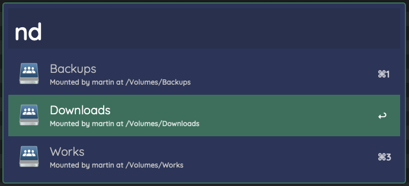

# alfred-network-drives
> List your mounted network drives

## Usage
1. activate Alfred
2. type `nd`
3. select your network drive to open in Finder

## Modifiers
Press `option` key to copy path to clipboard.
Press `control` to unmount drive.

## Demo

## Network protocols
Supported protocols: `smbfs` and `afpfs`.
